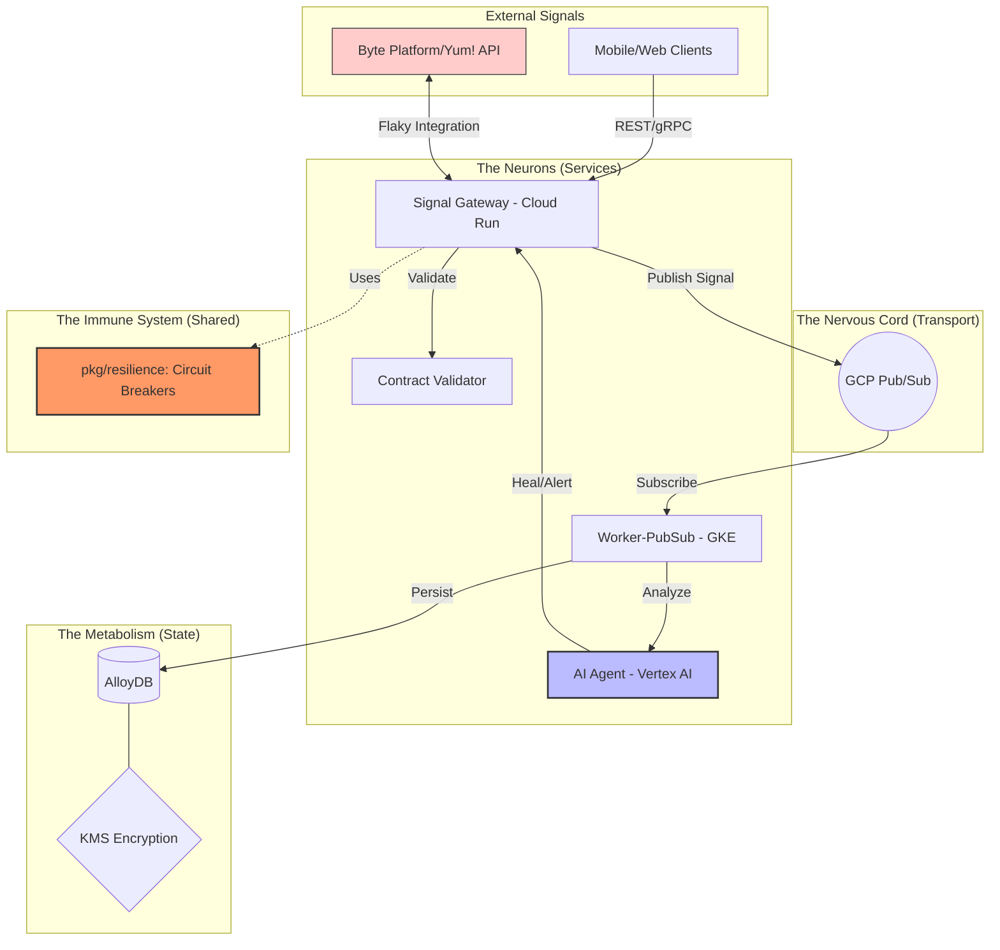

# MIA-DoD Nervous System (GCP + Go)

### *The "Integration Authority" Architecture*

# 📋 Overview
A high-resilience, AI-augmented integration authority designed for global-scale retail signal processing. This architecture implements a "Nervous System" metaphor to handle real-time ordering signals with enterprise-grade stability and cognitive anomaly detection.

## 🧠 Architectural Pillars
* **The Nervous Cord (Pub/Sub):** Durable, asynchronous message bus decoupling the high-traffic Gateway from the processing Workers.
* **The Higher Cognition (Vertex AI):** Real-time anomaly detection using Gemini 2.0 Flash to reason about signal integrity beyond standard schema validation.
* **The Metabolism (AlloyDB):** High-throughput PostgreSQL-compatible storage with dedicated read-pools for analytical offloading.
* **The Immune System (Go Resilience):** Custom circuit-breaker and exponential backoff patterns to protect the system from "thundering herd" failures.
* **Golang**, **Google Cloud Platform (GCP)**

## 🛠️ Tech Stack
- **Language:** Go 1.25.5 (Workspace-based Monorepo)
- **Infrastructure:** Terraform (Modular GKE Autopilot, Cloud Run, VPC, KMS)
- **Database:** Google Cloud AlloyDB
- **AI/ML:** Vertex AI (Gemini SDK)
- **Protocols:** OpenAPI 3.0 & Protobuf v3 

---

# 🚀 The Architecture: diagram placeholder
---



---

## 🧠 Architectural Philosophy

This project follows the "Nervous System" metaphor to categorize system components:

| Folder | System Component | Strategic Purpose |
| :--- | :--- | :--- |
| `services/` | **Neurons** | High-performance Go microservices handling real-time signals. |
| `pkg/resilience`| **Immune Response** | Circuit Breakers & Retry patterns via Go middleware. |
| `terraform/` | **Skeletal Structure** | Reproducible IaC (GKE, AlloyDB, Cloud Run). |
| `database/` | **Metabolism** | Versioned SQL migrations for consistent state management. |
| `docs/` | **Intelligence** | Architecture Decision Records (ADRs) & Engineering SOPs. |
| `agent/` | **Higher Cognition** | Self-healing integration logic powered by Vertex AI (Gemini). |

---

## 🛠️ Tech Stack & Standards
---

- **Language:** Golang 1.22+ (Idiomatic `internal/` package structure)
- **Infrastructure:** Terraform (Modular)
- **Compute:** GKE (Kubernetes) & Cloud Run (Serverless)
- **Messaging:** GCP Pub/Sub (Event-driven decoupling)
- **Database:** AlloyDB (High-performance PostgreSQL-compatible)
- **AI/ML:** Vertex AI (Gemini 2.0 Flash) for anomaly detection and healing.
- **Observability:** OpenTelemetry / DataDog ready.
---

## 🚀 Key DevX Features

### 1. Resilient Synapses (Integration Authority)
The system uses a centralized `pkg/resilience` library that implements **Circuit Breakers** and **Exponential Backoff**. This ensures that if the "Byte" or vendor APIs become flaky, the customer experience remains stable through graceful degradation.

### 2. Contract-First Design
Using `api/proto` and `api/openapi`, we enforce strict contracts between frontend clients and backend services, preventing "breaking changes" from reaching production.

### 3. Automated Metabolism
Database schemas are managed via versioned migrations in `database/migrations/`. This "Metabolism" ensures that environment drift is eliminated across Local, Dev, and Prod.

### 4. Self-Healing Intelligence
The `services/ai-agent` utilizes **Vertex AI** to monitor integration health. If a contract violation or an API anomaly is detected, the agent can suggest remediation steps or auto-mute "noisy" signals.

---

## 📂 Project Structure

```Text

mia-dod-nervous-system-gcpgo
├── 🤖 agent
│   └── 📝 prompts
│       └── integration_healing_system.txt
├── 🔌 api
│   ├── 📄 openapi
│   │   └── v1-spec.yaml
│   └── 📜 proto
│       └── signal.proto
├── 💾 database
│   ├── 🚀 migrations
│   │   └── 000001_init_schema.up.sql
│   ├── 🐚 scripts
│   └── 🧬 seeds
│       └── test_menu_items.sql
├── 📚 docs
│   ├── 🏛️ architecture
│   │   └── ADR-001-GCP-NATIVE-MIGRATION.md
│   ├── 🛡️ compliance
│   ├── 🇺🇸 GCP_FEDRAMP_ALIGNMENT.md
│   ├── 📏 INTEGRATION_STANDARDS.md
│   └── 🚨 SOP_INCIDENT_RESPONSE.md
├── 📦 pkg
│   ├── 🩹 resilience
│   │   ├── breaker_test.go
│   │   ├── breaker.go
│   │   ├── go.mod
│   │   └── retry.go
│   └── ☁️ vertexai
│       ├── client_test.go
│       ├── client.go
│       └── go.mod
├── 📝 README.md
├── ⚙️ services
│   ├── 🧠 ai-agent
│   │   ├── 🎬 cmd
│   │   │   └── main.go
│   │   ├── go.mod
│   │   └── 🛠️ internal
│   │       └── 🧪 logic
│   │           ├── inference_test.go
│   │           └── inference.go
│   ├── ⚖️ contract-validator
│   │   ├── go.mod
│   │   └── 🛠️ internal
│   │       └── 🔍 validator
│   │           ├── validator_test.go
│   │           └── validator.go
│   ├── ⚡ signal-gateway
│   │   ├── 🎬 cmd
│   │   │   └── main.go
│   │   ├── go.mod
│   │   └── 🛠️ internal
│   │       └── 📡 handler
│   │           ├── gateway_test.go
│   │           └── gateway.go
│   └── 📮 worker-pubsub
│       ├── 🎬 cmd
│       │   └── main.go
│       ├── go.mod
│       └── 🛠️ internal
│           └── 🔄 processor
│               ├── subscriber_test.go
│               └── subscriber.go
└── 🏗️ terraform
    ├── main.tf
    ├── 🧩 modules
    │   ├── 🗄️ alloydb
    │   ├── 🚀 cloud-run
    │   ├── ☸️ gke-cluster
    │   ├── 🆔 iam-roles
    │   ├── 🔐 kms-encryption
    │   ├── 📢 pubsub
    │   └── 🌐 vpc-network
    ├── outputs.tf
    ├── providers.tf
    └── variables.tf


```

# 🚦 Getting Started

Prerequisites
Go 1.22+

Google Cloud SDK (gcloud)

Terraform 1.5+

## Initialize Workspace

This project uses Go Workspaces to manage multiple modules:

```
Bash
go work init ./services/signal-gateway ./services/worker-pubsub ./pkg/resilience
go test ./...

```

### 🛡️ Final Snapshot of Your "Nervous System"
Before you sign off, here is the state of your project:

| Component | Status | Purpose |
| :--- | :--- | :--- |
| **Workspace Glue** | ✅ go.work Synced | All services and packages are interconnected. |
| **Immune System** | ✅ pkg/resilience | Circuit breaker logic ready for "flaky" APIs. |
| **The Heart** | ✅ signal-gateway | Entry point with resilience injected. |
| **The Reflexes** | ✅ worker-pubsub | Pub/Sub worker with AlloyDB (pgx) drivers. |
| **The Skeleton** | ✅ terraform/ | Modules defined for GCP infrastructure. |

# 🛡️ Security & Compliance
KMS Encryption: All sensitive data is encrypted at rest using Cloud KMS.

IAM Principle of Least Privilege: Fine-grained service account roles.

FedRAMP Ready: Architecture aligned with "High" impact security standards.

# Author: 
Alf Baez<br> 
Sr. Milti-Cloud and AI Solutions Architect; API Integration<br> 
Data/Database Architect, Security Advisor<br>
Architecting Secure & Intelligently Cloud & Hybrid Ecosystems<br>
High Volume IT Infrastructure, PaaS, IaaS, Saas

