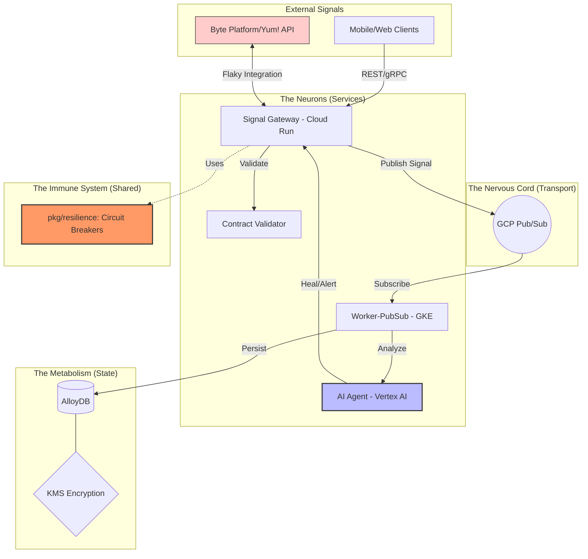

# Mia-DoD-Nervous-System-GCPGo

### *The "Integration Authority" Architecture*

The **Mia-DoD-Nervous-System-GCPGo** is a Staff-level reference architecture designed to untangle flaky, brittle integrations in complex multi-vendor retail ecosystems. It transforms a traditional backend into a resilient "Nervous System" using **Golang**, **Google Cloud Platform (GCP)**, and **Vertex AI**.

📋 Overview
---

# 🚀 The Architecture: diagram placeholder
---



---

## 🧠 Architectural Philosophy

This project follows the "Nervous System" metaphor to categorize system components:

| Folder | System Component | Strategic Purpose |
| :--- | :--- | :--- |
| `services/` | **Neurons** | High-performance Go microservices handling real-time signals. |
| `pkg/resilience`| **Immune Response** | Circuit Breakers & Retry patterns via Go middleware. |
| `terraform/` | **Skeletal Structure** | Reproducible IaC (GKE, AlloyDB, Cloud Run). |
| `database/` | **Metabolism** | Versioned SQL migrations for consistent state management. |
| `docs/` | **Intelligence** | Architecture Decision Records (ADRs) & Engineering SOPs. |
| `agent/` | **Higher Cognition** | Self-healing integration logic powered by Vertex AI (Gemini). |

---

## 🛠️ Tech Stack & Standards
---

- **Language:** Golang 1.22+ (Idiomatic `internal/` package structure)
- **Infrastructure:** Terraform (Modular)
- **Compute:** GKE (Kubernetes) & Cloud Run (Serverless)
- **Messaging:** GCP Pub/Sub (Event-driven decoupling)
- **Database:** AlloyDB (High-performance PostgreSQL-compatible)
- **AI/ML:** Vertex AI (Gemini 2.0 Flash) for anomaly detection and healing.
- **Observability:** OpenTelemetry / DataDog ready.
---

## 🚀 Key DevX Features

### 1. Resilient Synapses (Integration Authority)
The system uses a centralized `pkg/resilience` library that implements **Circuit Breakers** and **Exponential Backoff**. This ensures that if the "Byte" or vendor APIs become flaky, the customer experience remains stable through graceful degradation.

### 2. Contract-First Design
Using `api/proto` and `api/openapi`, we enforce strict contracts between frontend clients and backend services, preventing "breaking changes" from reaching production.

### 3. Automated Metabolism
Database schemas are managed via versioned migrations in `database/migrations/`. This "Metabolism" ensures that environment drift is eliminated across Local, Dev, and Prod.

### 4. Self-Healing Intelligence
The `services/ai-agent` utilizes **Vertex AI** to monitor integration health. If a contract violation or an API anomaly is detected, the agent can suggest remediation steps or auto-mute "noisy" signals.

---

## 📂 Project Structure

```text
.
├── agent/               # Vertex AI Prompt Templates & Logic
├── api/                 # Protobuf & OpenAPI Specifications
├── database/            # SQL Migrations & Seeding
├── docs/                # ADRs, Compliance & Architecture SOPs
├── pkg/                 # Shared Go Libraries (Resilience, VertexAI)
├── services/            # Go Microservices (Gateway, Workers, Agents)
└── terraform/           # GCP Infrastructure Modules

```

# 🚦 Getting Started

Prerequisites
Go 1.22+

Google Cloud SDK (gcloud)

Terraform 1.5+

## Initialize Workspace

This project uses Go Workspaces to manage multiple modules:

```
Bash
go work init ./services/signal-gateway ./services/worker-pubsub ./pkg/resilience
go test ./...

```

# 🛡️ Security & Compliance
KMS Encryption: All sensitive data is encrypted at rest using Cloud KMS.

IAM Principle of Least Privilege: Fine-grained service account roles.

FedRAMP Ready: Architecture aligned with "High" impact security standards.

# Author: 
Alf Baez<br> 
Sr. Milti-Cloud and AI Solutions Architect; API Integration<br> 
Data/Database Architect, Security Advisor<br>
Architecting Secure & Intelligently Cloud & Hybrid Ecosystems<br>
High Volume IT Infrastructure, PaaS, IaaS, Saas

